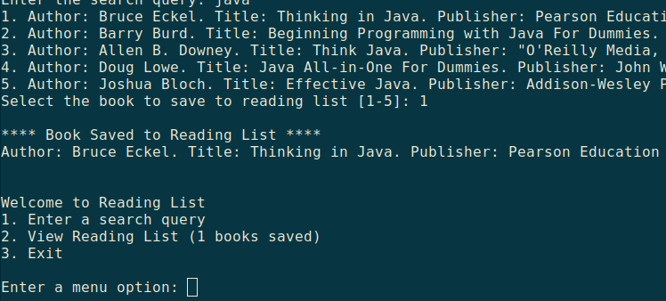

# Reading List with Google Books

A small CLI app that lets you query Google Books API.

* A query displays a list of 5 books (author, title, publishing company)
* You can select a book from the list to save to a "Reading List"
* You can view the "Reading List" with all books saved

# Install/Run

**From Terminal**

1. Git clone the repo.
2. Open repo directory `cd luzocho`
3. Install the conda env `conda env create --file=environment.yml`
4. Activate the env `conda activate luzocho`
5. From the terminal `python -m readinglist`

Note that if a conda environment named `luzocho` already exists in your system. You would need 
to modify the `environment.yml` file. On the first line that says `name: luzocho`, change the 
name to something else. Then activate that environment.

**From PyCharm**

1. Open cloned repo
2. Main menu/File/Open
3. Browse the directory that has the repo source file and the environment.yml
4. More details in PyCharm [here](https://www.jetbrains.com/help/pycharm/conda-support-creating-conda-virtual-environment.html#conda-requirements)
5. Then run `__main__.py`.

# Demo

My Gif recorder app wouldn't work so here are some screenshots.

After running the application with `python -m readinglist`. A menu shows 3 options. Enter a 
search query. If there are results, you can select the book to save to your Reading List. Then 
exit the application.

If this is the first time the application runs, it should have zero books saved. Entering option 
`2` 
confirms that there are no saved books.

The application checks when a search query is not found. First select option `1` to search a 
query, then type a combination of letters and number such as `aasdfa9sdfas9df`

Select `1` to search another query, for example `java`. It shows five results. You can select 
one of these, for example select the 1st one. The application then confirms that this selection 
is saved to the Reading List. The menu now shows that there is 1 book saved.

When you exit the application, the saved book(s) from the Reading List are exported to a file.

Start the application again. The file is imported and the Reading List shows the book 
that was saved before.

You can continue to search more books, select one to save to the Reading List, and upon exiting, 
the Reading List is exported.

# TDD

See `use_cases.md` for details.

Tested:

* User input when selecting an option from the menu
* Get a response from Google Books API using a mock

Running tests:

* The tests run from Pycharm in the `tests` folder
* I couldn't figure how to run the tests from the terminal

# How Google Books API search works

As seen in [Google Books API](https://developers.google.com/books/docs/v1/using), searching 
doesn't require authentication. You can get an url like this, and it returns 10 results:

    https://www.googleapis.com/books/v1/volumes?q=test+driven+development

Request the URL using the following syntax:

    url = urllib.request.urlopen("https://www.googleapis.com/books/v1/volumes?q=test+driven+development")

You can see the response status with:

    url.status

Then parse it with json:

    import json
    json_data = json.loads(data.decode('utf-8'))

The results are contained in `json_data['items']`. Then each book data is located in `[index]
['volumeInfo']`

# Feedback Refactor

Remove unused code that is not essential to run the application:

* The method `validate_menu_option` in `MainMenu` was removed as it was only there to pass a 
test, that was also removed.
* The getter and setter method in `MainMenu` were removed as they were not used.
* An unused import in `MainMenu` was removed

Correct implementation of a request response:

* The method `request_response_google_api` in `Search` was not used. Called this method in 
  `construct_json_data_google_api` to verify that a successful `200 OK` response is received. If 
  no data is received, a message is shown to the user that the application couldn't connect to 
  the Google API, and it loads the menu to try again.

Validate that a result is found:

* When the API responds with data, one of the attributes is `data['totalItems']`, which shows an 
  integer with the number of results. If the number is zero, the app tells the user 'No results 
  were found'.
* This can be tested with a random string of letters and numbers like: `ajja9djdjla` (0 results)
* Trying to outsmart the Google API is beyond this application :) Queries like these produce 
  results: `abc123xyz` (402 results), `r4ndom l33ters` (16 results)

Separate presentation from business logic:

* The `Result` class was refactored into two classes:
  * `BookResult` to extract the data for the five book results
  * `ResultMenu` to display the menu with the five results and let the user choose one.

* The `Bookshelf` class was refactored into two classes:
  * `BookSaver` to save selected result to the bookshelf
  * `Bookshelf` to show the list of saved books

* The `app.py` script was refactored and extracted the business logic to another class:
  * `MainMenuOption` to process the selected option from the main menu

Save results to a file:

* Implemented the class `BookshelfExporter`
  * It exports the saved books to the file `data/bookshelf_data.txt` if books were saved. If no 
    books were saved, it shows a corresponding message, and a file is not created.
  * The next time the application runs, if the user saves books, upon exiting, this data is 
    exported to the file.

* Implemented the class `BookshelfImporter`
  * It imports saved books if the file exists `data/bookshelf_data.txt`.
  * The imported books can be displayed in `View Reading List`
  * The user can search and save more books, upon exiting, all the books in the Reading List are 
    exported again to this text file.

# References

* Remove punctuation in a string [here](https://stackoverflow.com/a/266162)